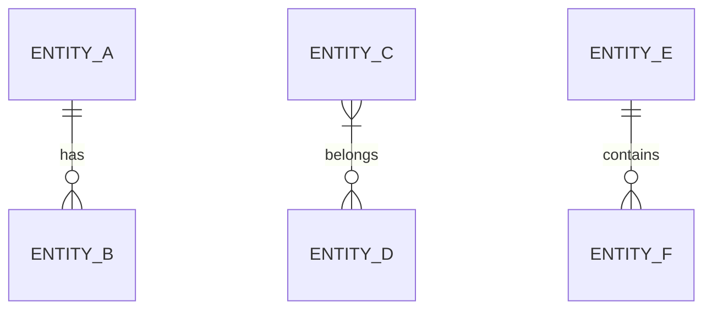

# {{PROJECT_NAME}} 전체 ERD

## 전체 엔티티 관계도

<!--
  작성 가이드:

  1. Mermaid erDiagram 문법을 사용합니다.
  2. 도메인 그룹별로 주석(%%)으로 섹션을 구분합니다.
  3. 관계 표기법:
     - ||--o{  : 1:N (one-to-many)
     - }|--o{  : M:N (many-to-many, 중간 테이블)
     - ||--o|  : 1:1 (one-to-one)
  4. entity-spec.md와 반드시 일치시킵니다.
  5. 엔티티가 추가/변경되면 이 ERD도 함께 갱신합니다.

  Mermaid 참고: https://mermaid.js.org/syntax/entityRelationshipDiagram.html
-->

---

## 관계 요약

| 관계 | 타입 | 설명 |
|------|------|------|
| ENTITY_A → ENTITY_B | 1:N | {{설명}} |
| ENTITY_C ↔ ENTITY_D | M:N | {{설명}} (중간 테이블: {{JUNCTION_TABLE}}) |
| ENTITY_E → ENTITY_F | 1:1 | {{설명}} |
